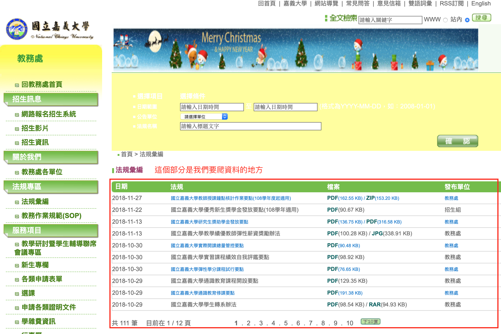
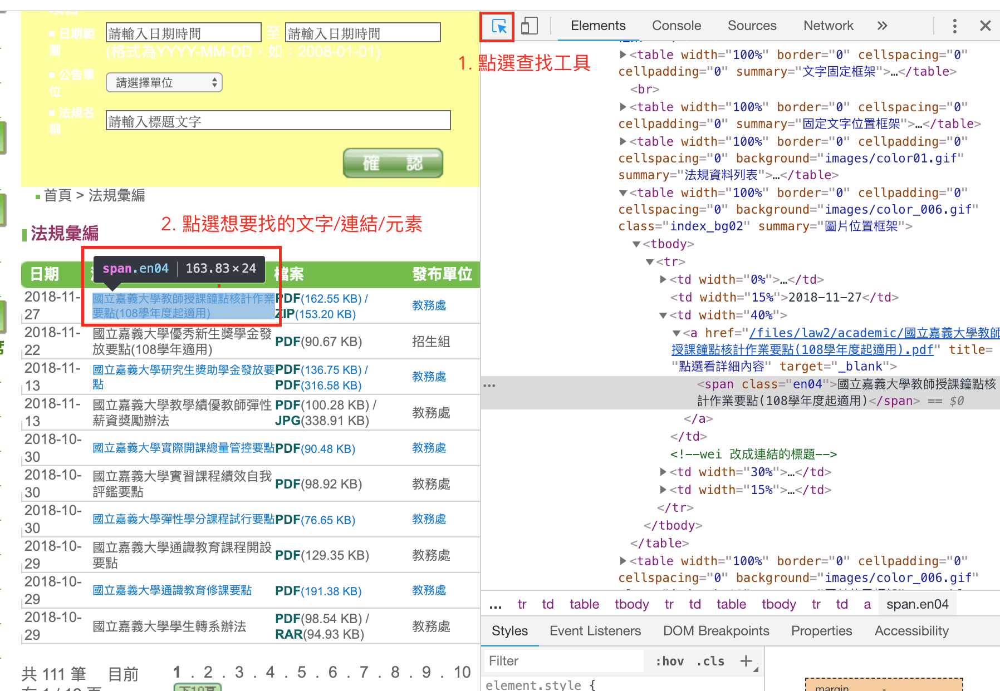

### 目標

這個教學將簡單介紹如何使用 R 的 rvest 套件來批次抓取網路上的資料。

### 先備知識

1. 具有 R 的基礎能力(安裝套件、了解變數、資料結構及迴圈的使用等)
2. 具有初級的 HTML 及 CSS 閱讀能力

### 需安裝的套件

* [rvest](https://github.com/hadley/rvest) 
* [curl](https://cran.r-project.org/package=curl)

rvest 是 Hadley Wickham 開發的簡單網路爬蟲套件，可以使用 ```install.packages('rvest')``` 安裝

### 步驟

#### 1. 分析網頁結構

以國立嘉義大學教務處[法規彙編](http://www.ncyu.edu.tw/academic/law_list.aspx)為例，
若今天想把所有的相關教務法規下載，傳統方式就是一個連結一個連結手動點。
可是這個頁面有 12 頁，如果每頁都是十筆資料，那就要點 120 次，會點到很厭世!

如下圖：


接下來開啟你瀏覽器的開發工具，以 Google Chrome 為例，是在 View -> Developer -> Developer Tools，開啟之後點選 Ctrl-Shift-C 或是 Command-Shift-C 來啟用點選查詢元素的工具。如下圖：



所以我們要下載的是「法規」（雖然上面的表格中有「檔案」，但實際上我只想要下載法規，
而且檔案的連結和法規本文大多是重複的）和「法規日期」。用 inspect elements tool 
查了之後可以找到我們所需要的是「法規」中的 ```<a href="法規檔案連結下載.pdf" ...>``` 
因此他的路徑是 table 屬性為 class="index_bg02"，下面的 tbody -> tr -> td -> a
所以 [XML 語言路徑(XML path language; 簡稱 xpath)](https://zh.wikipedia.org/zh-tw/XPath) 
是
```{xml}
//table[@class="index_bg02"]//tbody//tr//td[@width="40%"]//a
```
    
    備註：這部分需要有些 html/xml 的概念
   
同樣地也可以把日期的 xpath 找出來

#### 2. 實作

##### 2.1 載入 rvest

```{r}
library(rvest)
```

2.2 設定網址變數

因為檔案是相對路徑，我們希望能組合成完整的網址，因此需要設定 ```prefix``` 為 http://www.ncyu.edu.tw。
另外也設定好法規彙編的網址變數為 ```acaLawPage```，其值為 http://www.ncyu.edu.tw/academic/law_list.aspx?pages=

```{r}

prefix <- 'http://www.ncyu.edu.tw'
acaLawPage <- 'http://www.ncyu.edu.tw/academic/law_list.aspx?pages='

```

##### 2.3 自動抓取表格的總頁數

這個步驟中我們會使用到 ```%>%``` 這個 R 特別的導向指令（類似 unix 的 > 或 < 重導向(redirect) 指令 ），```%>%``` 的左方執行完後會把結果倒給右方的指令，例如：
```{r}
ls() %>% length()
```
表示用 ```ls()``` 列出目前的工作階段下的 r object，並導向給 ```length()``` 函式計算數量

```{r}
# 使用 read_html 先讀取網頁，節省重複讀取時間
acaLawPage1 <- read_html('http://www.ncyu.edu.tw/academic/law_list.aspx?pages=0')
# 
# 找到 pagecount 之後，用 html_text() 轉成文字，再轉成數值(as.numeric)
totalPages <- acaLawPage1 %>% 
  html_nodes(xpath = '//span[@id="pagecount"]') %>%
  html_text() %>% 
  as.numeric()
```

我們要把這個頁數存成 totalPages 變數，之後用迴圈的時候會用到。

##### 2.4 先抓一個頁面試試看

我們以 http://www.ncyu.edu.tw/academic/law_list.aspx?pages=0 的法規共十筆資料來試做看看

先把前面讀取的 acaLawPage1 導向給 html_nodes 來讀取網頁中的節點，再導向給 html_text()
轉成文字，這樣就抓下來這頁的所有標題了

```{r}
acaLawPage1 %>%
    html_nodes(xpath = '//table[@class="index_bg02"]//td[@width="40%"]//a//span') %>%
    html_text() 
```

存成 pageTitle 留待後面使用
```{r}
pageTitle <- acaLawPage1 %>%
    html_nodes(xpath = '//table[@class="index_bg02"]//td[@width="40%"]//a//span') %>%
    html_text() 
```

接下來則是檔案的日期

```{r}
acaLawPage1 %>%
    html_nodes(xpath = '//table[@class="index_bg02"]//td[@width="15%"]') %>%
    html_text() 
```

疑？竟然有 19 個欄位，這是因為「日期」和「發布單位」的 ```td[@width="15%"]``` 都相同，
因此我們用 grep 來取出有數字的元素，即：

```{r}
fileDate <- acaLawPage1 %>%
    html_nodes(xpath = '//table[@class="index_bg02"]//td[@width="15%"]') %>%
    html_text() 
fileDate <- fileDate[grep('[0-9]', fileDate)]
fileDate
```

然後我們再抓取檔案。因為檔案路徑寫在 ```<a href="">``` 裡頭，所以我們要用 ```html_attr()``` (html attribute) 來取得 ```href``` 後面的值

```{r}
fileURL <- acaLawPage1 %>%
    html_nodes(xpath = '//table[@class="index_bg02"]//td[@width="40%"]//a') %>%
    html_attr('href')
fileURL
```

接下來再把這些檔案的相對路徑和前面提到的 ```prefix``` 使用 ```paste()``` 合併在一起

```{r}
fileURL <- paste(prefix, fileURL, sep='')
fileURL
```

最後，把日期、法規名稱還有檔案 URL 用 ```cbind()``` 合併起來儲存成一個 data.frame

```{r}
pgs <- data.frame()
currentPage <- cbind(fileDate, pageTitle, fileURL)
pgs <- rbind(pgs, currentPage)
pgs
```

有了這個表之後，我們就能夠下載檔案了！

##### 2.5 使用 cURL 下載檔案

在下載檔案之前，我們需要把網址中的 UTF-8 編碼的文字轉成 ASCII 純文字的 URI，
因此要透過 ```URLencode()``` 來做轉換，例如：

```{r}
as.character(pgs[1,3])
```

轉換後變成

```{r}
# 因為網址欄位為 factor ，所以要轉成 character
URLencode(as.character(pgs[1,3]))
```

接下來用 ```curl_download()``` 來下載

```{r} 
library(curl)
# 為了讓存檔的檔名能夠有一致性，並避免重複，
# 所以我們把檔名改成 yyyy-mm-dd_filename.pdf，
# 例：2018-11-13_國立嘉義大學教師授課鐘點核計作業要點(108學年度起適用).pdf
curl::curl_download(URLencode(as.character(pgs[1,3])), 
                      paste('/tmp/ncyu_aca_affairs/', pgs[1,1], '_', pgs[1,2], '.pdf', sep = ''))
```

最後我們使用迴圈把上述組合起來即可，完整 code 請參考 https://gist.github.com/mutolisp/8a13489cf9d16eefe0c49196c06588a2